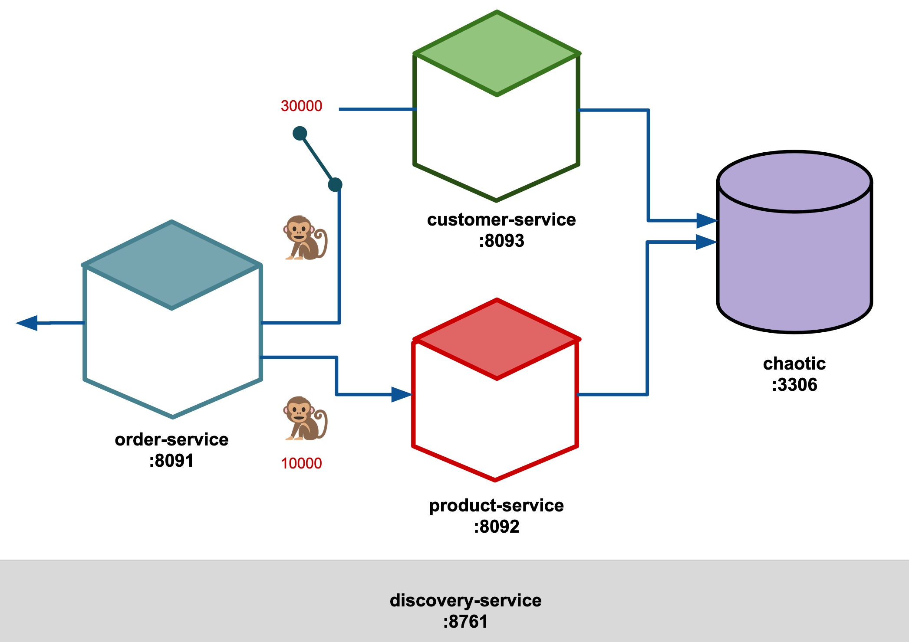

# learning-chaos-springboot

[](https://maven.apache.org/)

> Java Spring Boot Microservices to test resilience strategies with Chaos Engineering.
>
> Developed by Chaos Guild Team.

## Prerequisites

You will need the following things properly installed on your computer.

- [Git](http://git-scm.com/)
- [Maven](https://maven.apache.org/developers/index.html)
- [Docker](https://www.docker.com/)

## Installation

- Clone the repository.

```bash
  git clone https://github.com/yurynino/learning-chaos-springboot.git
```

- Change into the new directory.

```bash
  cd learning-chaos-springboot
```

### Configure the database

- Run MySQL database locally using its Docker image. The Docker command visible below also creates database and user with password.

```bash
  docker run -d --name mysql -e MYSQL_DATABASE=chaos -e MYSQL_USER=chaos -e MYSQL_PASSWORD=chaos123 -e MYSQL_ROOT_PASSWORD=123456 -p 33306:3306 mysql
```

- Set the proper values in the application.yml file to connect a database with each microservice.

```bash
  url: jdbc:mysql://localhost:33306/chaos?allowPublicKeyRetrieval=true&useSSL=false
  username: chaos
  password: chaos123
  driverClassName: com.mysql.jdbc.Driver
```

### Build project

- Using Maven.

```bash
  mvn clean install
```

### Deploy on Cloud

- [AWS ECS](README_aws_ecs.md)
- [Azure APP](README_az_app.md)
- [Azure AKS](README_az_aks.md)

## Architecture

<div align="center">
  
</div>

## Contributing

If you find this repo useful, send a Merge Request with your awesome new features and bug fixes.

## Further Reading / Useful Links

- [Maven](https://maven.apache.org/developers/index.html)
- [Deploy](https://docs.microsoft.com/en-us/azure/app-service/tutorial-custom-container?pivots=container-linux)
